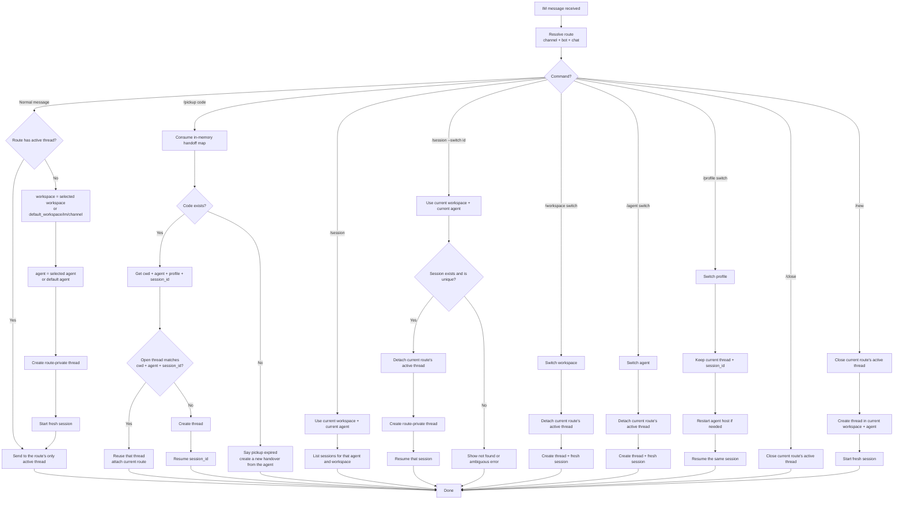
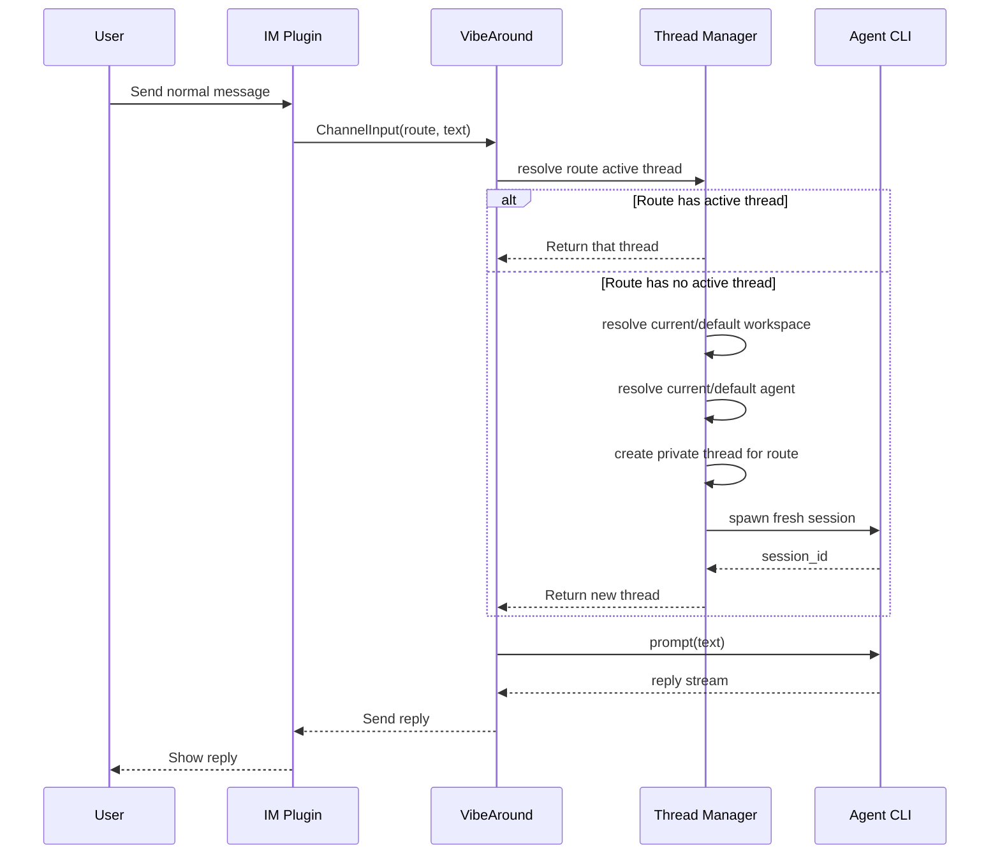
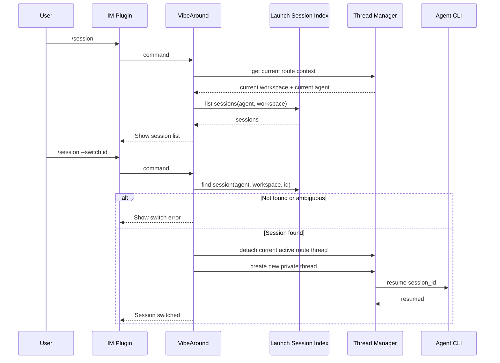
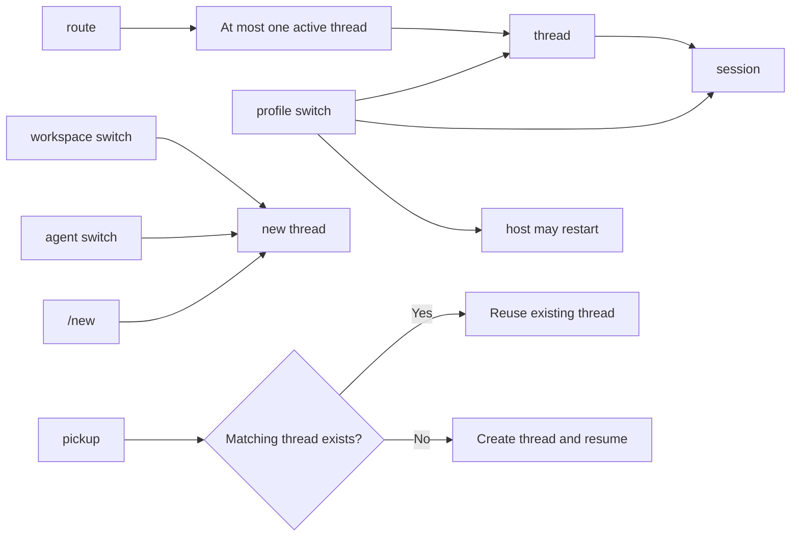

The messaging app session workflow defines how VibeAround selects a workspace, thread, and session when a user talks to a local AI coding agent from apps such as Feishu/Lark, Discord, Slack, Telegram, or WeChat.

The core rule is: **normal messages are route-private; only explicit continuation resumes a session.** A route is identified by the channel, bot, and chat. Each route can have at most one active thread.

## Workspace Path

Normal IM conversations use the default IM workspace:

```txt
<default_workspace>/im/<channel>
```

For example:

- Feishu/Lark: `<default_workspace>/im/feishu`
- Discord: `<default_workspace>/im/discord`
- Slack: `<default_workspace>/im/slack`

Users can change the global `default_workspace` in Settings. Messaging channel workspaces are not adjusted from the messaging channel; if a user explicitly switches workspace, the current route starts a new thread in the target workspace.

## Rules

- Normal message: use only the current route's active thread; if none exists, create a new thread and a fresh session.
- `/pickup <code>`: consume only short-lived handoff codes created by a local agent. Codes live in memory, so they expire when the app restarts; create a new handover from the agent if that happens.
- Pickup: if an open thread already matches the handoff payload, such as a Web Chat thread, attach the current route to it; otherwise create a thread and resume the specified session.
- `/session`: list sessions for the current agent in the current workspace. The current agent is the manually selected route agent, or the default agent when none was selected.
- `/session --switch <id>`: switch only when exactly one existing session matches. If no session is found or the id is ambiguous, show an error instead of creating a new session.
- Workspace or agent changes: create a new thread and start a fresh session.
- Profile changes: keep the current thread and session; restart the agent host if needed, then resume the same session.
- `/close`: close the current route's active thread.
- `/new`: close the current route's active thread, then create a new thread in the current workspace and agent with a fresh session.

## Overall Flow



## Normal Message Sequence



## Pickup Sequence

```mermaid
sequenceDiagram
  participant A as Agent
  participant MCP as VibeAround MCP
  participant H as Handoff Map
  participant IM as IM Route
  participant TM as Thread Manager
  participant AG as Agent CLI

  A->>MCP: prepare_handover(cwd, agent, profile, session_id)
  MCP->>H: store(code -> payload)
  MCP-->>A: /pickup CODE

  IM->>TM: /pickup CODE
  TM->>H: consume(CODE)

  alt Code does not exist
    TM-->>IM: Pickup expired; create a new handover
  else Code exists
    H-->>TM: cwd + agent + profile + session_id
    TM->>TM: find open thread by cwd + agent + session_id

    alt Existing thread found
      TM->>TM: attach current route to existing thread
      TM-->>IM: Attached to that thread
    else No matching thread
      TM->>TM: create new thread
      TM->>AG: resume session_id
      AG-->>TM: resumed
      TM-->>IM: Handoff session resumed
    end
  end
```

## Session Command Sequence



## State Constraints


