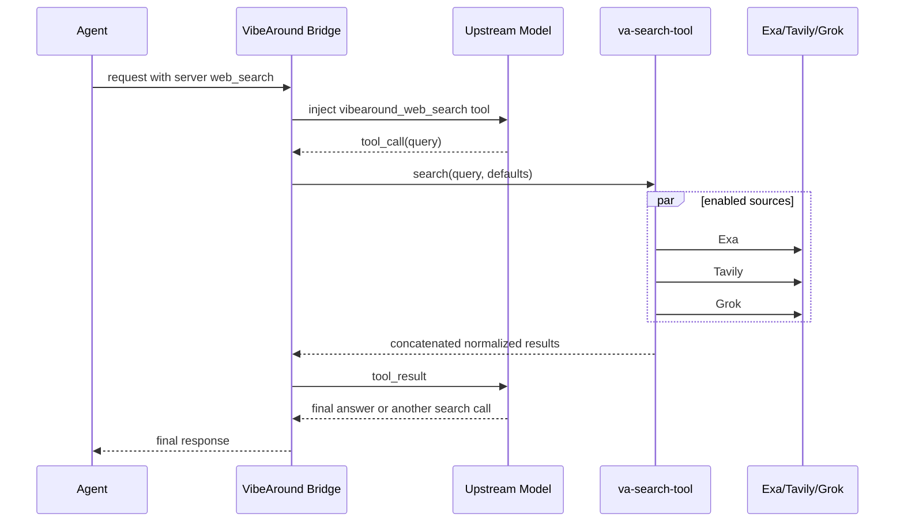

VibeAround can supply host-side web search when an agent asks for provider or server-side `web_search` but the selected upstream model provider cannot run that tool natively.

This capability is not a normal agent-visible function that the client owns. The API Bridge detects server tool declarations, exposes a temporary host search tool to the upstream model, runs configured search providers from the VibeAround host, then feeds the search results back to the model before returning the final answer to the agent.

## Request Flow

The bridge does not search before asking the model. The first model call receives a temporary `vibearound_web_search` tool. If the model decides it needs current information, it calls that tool. If the model can answer without search, no provider search runs.

## Internal Search Rounds

The bridge limits the internal fallback loop to a small number of model/tool rounds. One round means:

1. The upstream model returns a `vibearound_web_search` tool call.
2. VibeAround consumes that tool call.
3. `va-search-tool` queries the enabled search sources.
4. The bridge appends the tool result and asks the model again.

This is a model-turn limit, not a fixed number of search API calls. A direct final answer uses zero search rounds. A model that searches once and then answers uses one round. The limit prevents a model from repeatedly asking the host to search forever.

## Search Sources

Enable sources from Settings > Search. VibeAround currently supports:

- Exa
- Tavily
- Grok/xAI web search

When multiple sources are enabled, `va-search-tool` searches them in parallel. Successful results are concatenated in configured source order. VibeAround does not deduplicate results and does not rerank across providers. If a provider returns a native score, the normalized result includes it. If the provider does not return a score, VibeAround leaves the score empty instead of inventing one.

## Search Defaults

The Search settings include:

| Setting | Meaning |
| --- | --- |
| Max results per source | Maximum results requested from each enabled source. If Exa and Tavily are both enabled and the value is `5`, the model may receive up to 10 results before Grok is considered. |
| Search context size | A `low`, `medium`, or `high` hint that controls how much source content a provider should return. |

Incoming agent requests can still specify their own `max_results` or `search_context_size`. When they do not, VibeAround passes the saved defaults to `va-search-tool`.

## Operational Notes

- Search is disabled unless the Search tool is enabled in settings.
- Each enabled source needs its own API key.
- The host search runtime is a supervised local process.
- If no search runtime or provider key is available, the model receives a tool error instead of synthetic results.
- Provider-specific behavior still matters. VibeAround normalizes the shape but does not make all search APIs identical.
