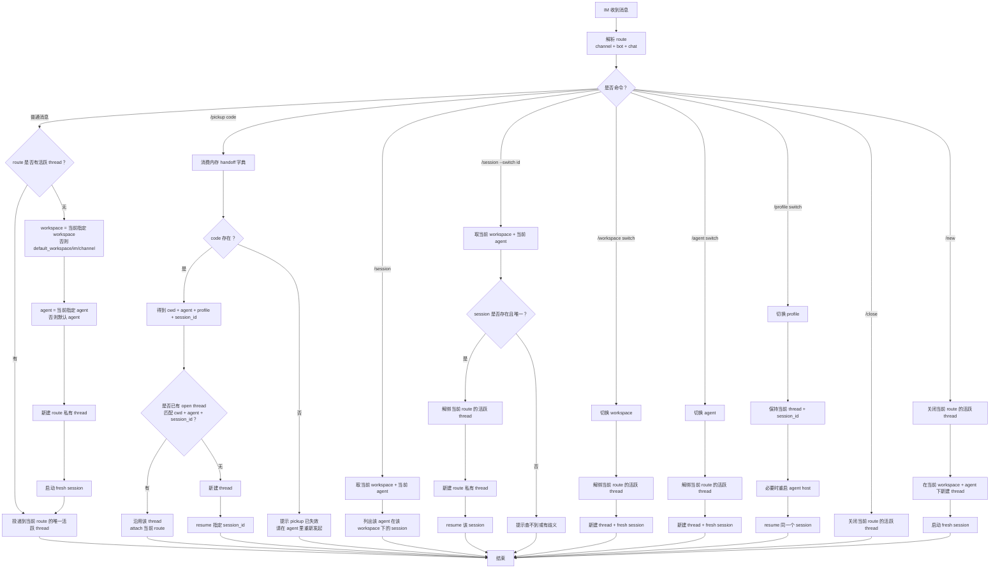
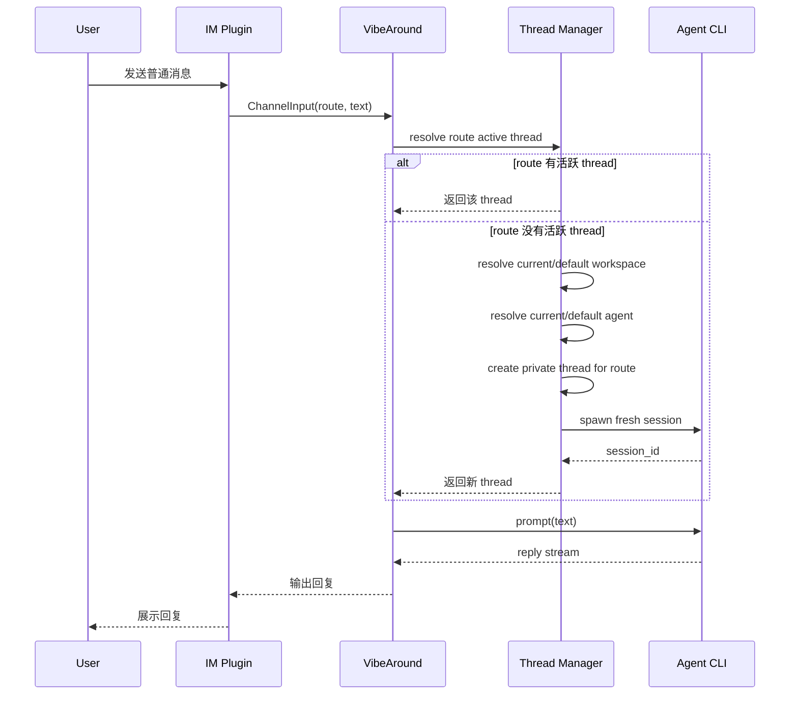
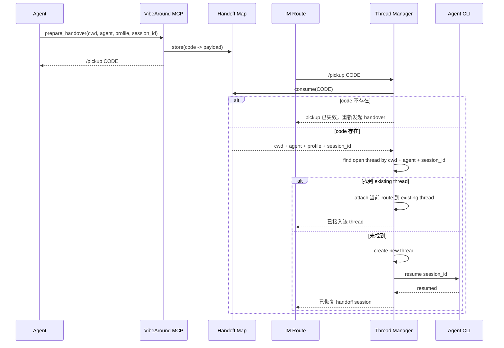
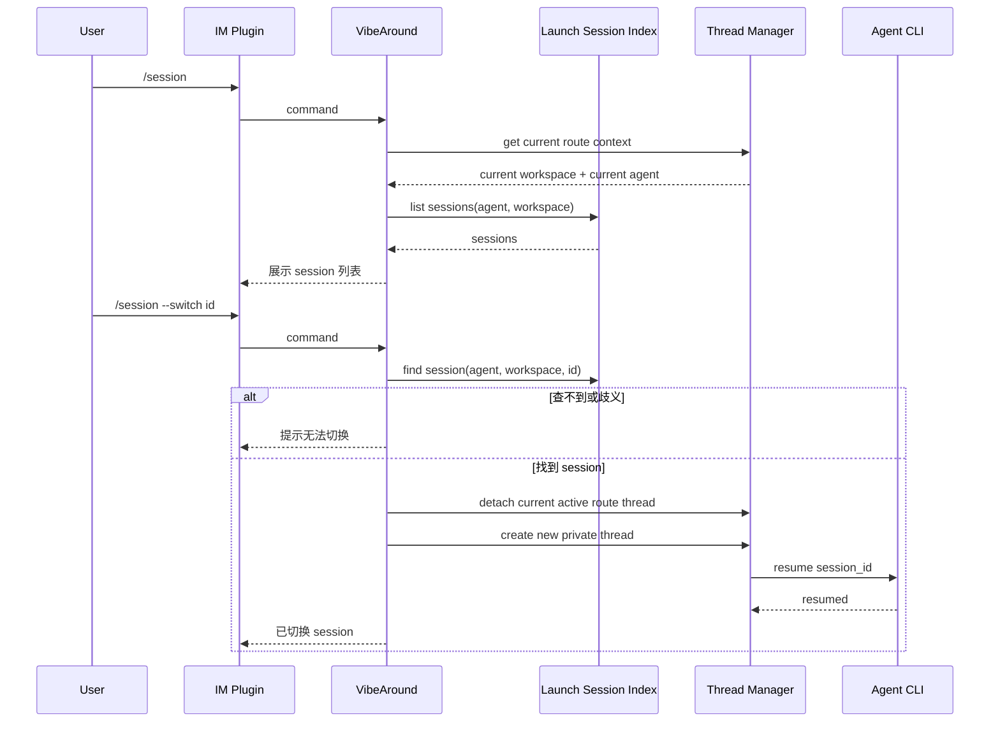
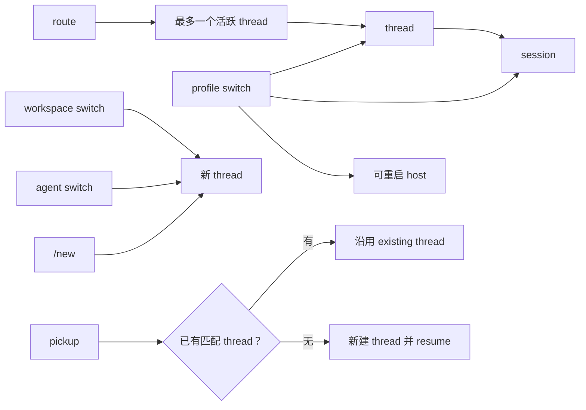

消息应用会话工作流定义了用户从飞书/Lark、Discord、Slack、Telegram、微信等消息应用和本地 AI coding agent 交互时，VibeAround 如何选择 workspace、thread 和 session。

核心规则是：**普通消息 route 私有，显式 continuation 才复用 session。** 一个 route 由 channel、bot 和 chat 共同确定；每个 route 最多只有一个活跃 thread。

## Workspace 路径

普通 IM 会话使用默认 IM workspace：

```txt
<default_workspace>/im/<channel>
```

例如：

- 飞书/Lark：`<default_workspace>/im/feishu`
- Discord：`<default_workspace>/im/discord`
- Slack：`<default_workspace>/im/slack`

用户可以在 Settings 的通用设置中修改全局 `default_workspace`。IM channel 自己的 workspace 不从消息端调整；如果用户显式切换 workspace，当前 route 会在目标 workspace 上新建 thread。

## 规则

- 普通消息：只使用当前 route 的活跃 thread；没有活跃 thread 就新建 thread 和 fresh session。
- `/pickup <code>`：只消费由本地 agent 发起的短期 handoff code。code 在内存字典中，应用重启后会失效，需要在 agent 里重新发起 handover。
- Pickup：如果 handoff payload 对应的 open thread 已存在，例如从 Web Chat 发起的对话，就沿用该 thread；否则新建 thread 并 resume 指定 session。
- `/session`：列出当前 workspace 下当前 agent 的 session。当前 agent 来自 route 的手动选择；没有手动选择时使用默认 agent。
- `/session --switch <id>`：必须先找到唯一 session；查不到或有歧义时提示错误，不创建新 session。
- Workspace 或 agent 改变：新建 thread，并启动 fresh session。
- Profile 改变：保留当前 thread 和 session；必要时重启 agent host，并 resume 同一个 session。
- `/close`：关闭当前 route 的活跃 thread。
- `/new`：等价于先 `/close`，再在当前 workspace 和 agent 下新建 thread，并启动 fresh session。

## 总流程



## 普通消息时序



## Pickup 时序



## Session 命令时序



## 状态约束


