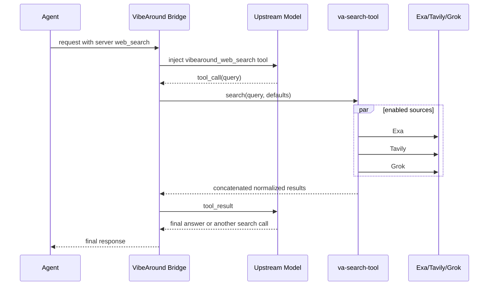

当 Agent 请求 provider 或 server-side `web_search`，但当前上游模型 Provider 不能原生执行这个工具时，VibeAround 可以由本地主机补上搜索能力。

这个能力不是普通的 agent-visible function tool。API Bridge 会识别 server tool 声明，临时向上游模型暴露 `vibearound_web_search`，由 VibeAround host 调用已配置的搜索 Provider，再把结果作为 tool result 喂回模型，最后把模型的最终回答返回给 Agent。

## 请求链路

Bridge 不会在看到请求后先搜索。第一轮会先把临时的 `vibearound_web_search` tool 给上游模型。如果模型认为需要实时信息，它会调用这个 tool；如果模型可以直接回答，就不会发生搜索。

## 内部搜索轮次

Bridge 会限制 fallback 内部循环的轮次。这里的一轮是：

1. 上游模型返回 `vibearound_web_search` tool call。
2. VibeAround 消费这个 tool call。
3. `va-search-tool` 查询启用的搜索源。
4. Bridge 把 tool result 追加到上下文，再问模型一次。

这个限制是模型/tool 对话轮次，不是固定搜索 API 调用次数。模型直接回答就是 0 轮；模型搜索一次后回答就是 1 轮；模型看完结果还要求继续搜索另一个 query，才进入下一轮。轮次上限是为了防止模型一直要求搜索。

## 搜索源

在 Settings > Search 中启用搜索源。当前支持：

- Exa
- Tavily
- Grok/xAI web search

启用多个 source 时，`va-search-tool` 会并行搜索。成功结果按 source 顺序拼接。VibeAround 不会做去重，也不会跨 Provider rerank。如果 Provider 原始返回 score，规范化结果会保留；如果 Provider 没有返回 score，VibeAround 不会自己生成一个假 score。

## 搜索默认值

Search 设置包含：

| 设置 | 含义 |
| --- | --- |
| Max results per source | 每个启用 source 最多请求多少条结果。例如同时启用 Exa 和 Tavily，值为 `5` 时，模型最多可能先收到 10 条结果。 |
| Search context size | `low`、`medium`、`high` 三档上下文提示，用来控制 Provider 返回多少来源内容。 |

Agent 请求仍然可以自己指定 `max_results` 或 `search_context_size`。如果请求里没有指定，VibeAround 会把设置里的默认值传给 `va-search-tool`。

## 运行注意事项

- Search tool 默认不启用，需要在设置里打开。
- 每个启用的 source 都需要自己的 API key。
- Host search runtime 是一个受监督的本地进程。
- 如果搜索 runtime 不可用或没有可用 key，模型会收到 tool error，而不是收到模拟结果。
- Provider 差异仍然存在。VibeAround 会规范化返回结构，但不会假装所有搜索 API 完全一样。
